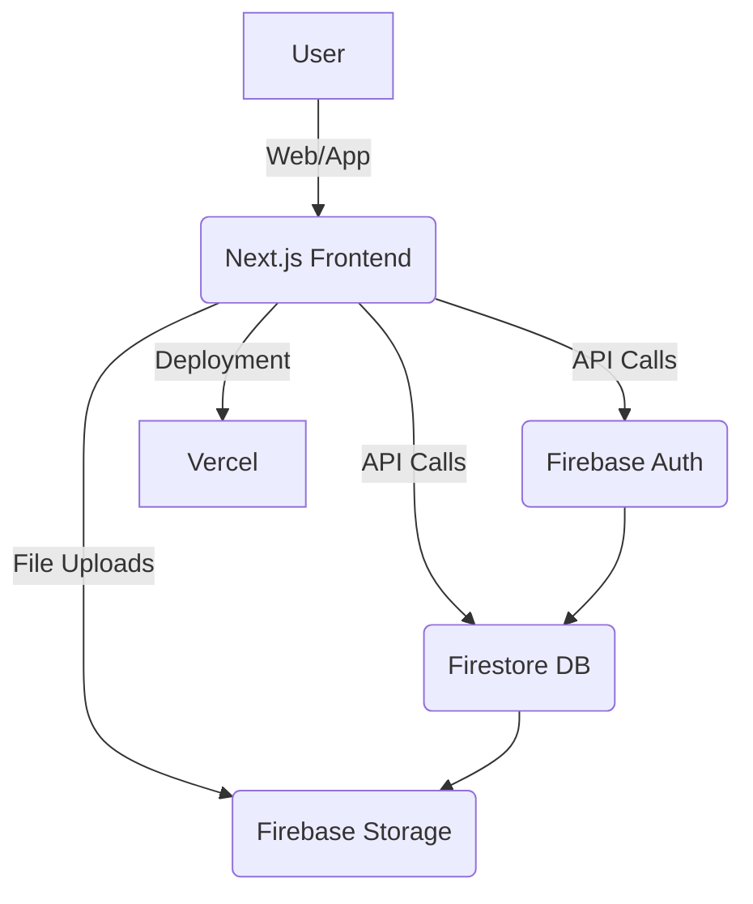

# 🏛️ EduConnect – System Architecture

## 🖼️ High-Level Architecture Diagram

---

## 🧩 Component Breakdown
| Component      | Description |
| -------------- | ----------- |
| Next.js Frontend | React-based UI, SSR/SSG, routing, forms |
| Firebase Auth  | User authentication, role management |
| Firestore DB   | Real-time NoSQL database for users, appointments, messages |
| Firebase Storage | File uploads (profile pics, docs) |
| Vercel         | Cloud deployment, CI/CD |

---

## 🔄 Data Flow
1. **User** interacts with the web app (register, login, book, message)
2. **Frontend** sends requests to Firebase Auth (for login) and Firestore (for data)
3. **Auth** validates user, issues tokens
4. **Firestore** stores/retrieves user, appointment, and message data in real time
5. **Storage** handles file uploads/downloads
6. **Vercel** serves the frontend and handles deployments

---

## 🛠️ Technology Stack
- **Frontend:** Next.js 14, React, TypeScript, Tailwind CSS
- **Backend:** Firebase Auth, Firestore, Storage
- **Deployment:** Vercel
- **UI:** shadcn/ui, Lucide React

---

## 🖌️ Wireframes (Main Screens)
- **Home:** Hero, features, testimonials, CTA, footer
- **Student Dashboard:** Teacher search, appointments, messages
- **Teacher Dashboard:** Availability, appointments, analytics
- **Admin Dashboard:** User management, approvals, analytics
- **Shared:** Navigation, modals, notifications

---

## 🛡️ Security & Scalability
- Role-based access control (student, teacher, admin)
- Firestore security rules for data isolation
- Scalable serverless backend (Firestore, Storage)
- CI/CD with Vercel for rapid deployment
- Responsive, mobile-first UI

---

> **EduConnect Architecture** – Built for performance, security, and a world-class user experience. 